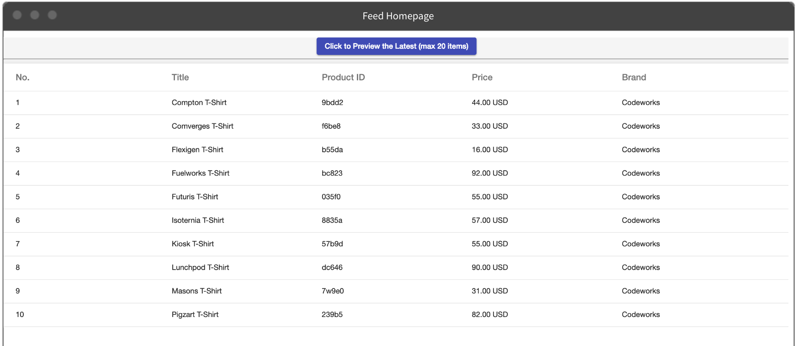

# scraping-project

This scraping tool provides default methods to retrieve product information from an example website (https://enhancedecommerce.appspot.com/) and save the product data to database on a regular basis. The information is centralized in one place and can be sent to advertising plastform like Google Merchant Center or Facebook Marketplace in order to serve dynamic ads.

<p aling="left">
 
</p>


# Getting Started
1. Have your Google Merchant Center account and Goolge API Credential ready. Google Content API needs to be enabled in your Google Cloud Project

2. Create a mongo database named products with two collections: products and histories

3. Clone the repo and get servers running

```
# Download the repo
mkdir ~/projects/scraping
cd ~/projects/scraping
git clone https://github.com/shanshanc/scraping-project.git

# Get the backend up and running
cd ~/server
npm install
nodemon

# Get the fronend up and running
cd ~/client
npm install
ng serve
```

4. Go to the endpoint /fetch from the backend to retrieve product info

5. See the results in the root (/) from the frontend


# Tech stack

### Frontend
* Angular
* Angular Meterial
* D3.js

### Backend
* Node.js
* Nightmare.js
* Koa
* Mongoose
